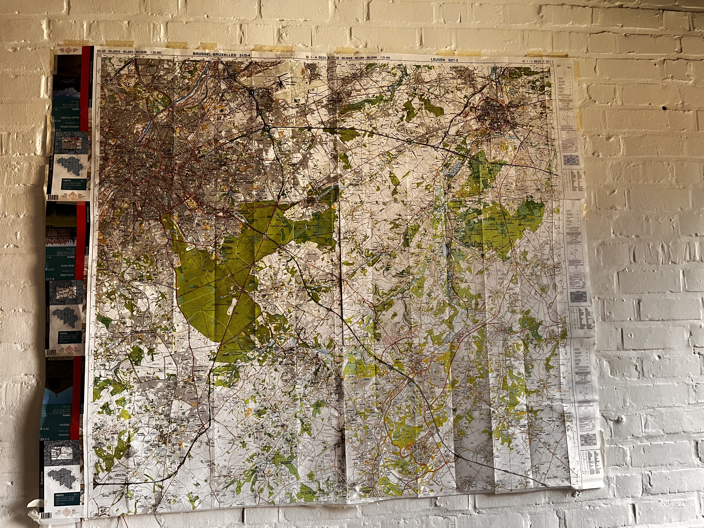

# Overview

This document provides essential information for the design and implementation of 
the Smart Map System. 
Powered by [Writerside](https://www.jetbrains.com/help/writerside/getting-started.html) and deployed via GitHub Actions, 
the system aims to track and display real-time train locations. 

For detailed insights into the system's requirements,
please refer to the ["Software Requirement Specification"](Software-Requirement-Specification.md).

## Architecture

The Smart Map System consists of two main components: the client and the server. The server provides general information
because it doesn't and cannot know how the client works. The client handles specific functionalities, such as displaying 
train locations using LEDs.

### Client

The client subscribes to the server's data to display the current locations of trains. 

### Server

The server publishes real-time train data. 

#### How does it work

The server establishes a connection with the broker(Eclipse Mosquitto),
then every few seconds, it queries the database to retrieve data on all running trains in 
the area of interest. The server then posts this data in json format to the broker:

```json
[
  {
    "type": "train",
    "route_id": "539",
    "route_short_name": "S8",
    "route_long_name": "Louvain-la-Neuve -- Bruxelles-Midi",
    "stop_id": "8811601",
    "stop_name": "Ottignies",
    "departure_time": "19:47:00",
    "time_now": "19:46:00",
    "next_stop_arrival_time": "19:53:00",
    "next_stop_id": "8811544",
    "next_stop_name": "Profondsart"
  }
]
```

The server operates in two modes: DEV and PROD. In PROD mode, the server processes real data. In DEV mode, it generates
the test data for the route between Louvain-la-Neuve and Ottignies stations.

The database used is Sqlite3, stored on Google Drive. The database is downloading using `gdown` when the server starts.
The data follows the GTFS format, obtained from Belgian public train data.

The initial version of the server uses the following steps to interact with the database:

1. Create helper tables to filter necessary data.
2. Create necessary indexes.
3. Generate helper views using an SQL script.
4. Use a final statement to query the necessary data from the views.


Helper tables are created daily at night and when the server starts. Views are created for each query. Despite this
approach being suboptimal, the entire query process takes approximately 400ms, significantly improved from the initial
3 minutes due to the use of helper tables and indexes. 


## Map and LED Demo

### Map Image

Here is the map image showing the area covered by the Smart Map System:




### LED Demo

The following video demonstrates how LEDs are used to display train locations. 

<video src="https://youtu.be/6NPY-Aikeu4"/>

## Technology

### Server side and Client Side
1. **MQTT(Eclipse Mosquitto)**: For messaging and communication between the server and clients
2. **Python Logging**: For logging configuration and management. 

### Server Side

1. **SQLite3**: For data base storage
2. **gdown**: For downloading the database from Google Drive
3. **GTFS(General Transit Feed Specification**: For structuring public transit data.

### Client Side
1. **YAML**: Config the LEDs layout on the map
2. **neopixel**: Control the LEDs
